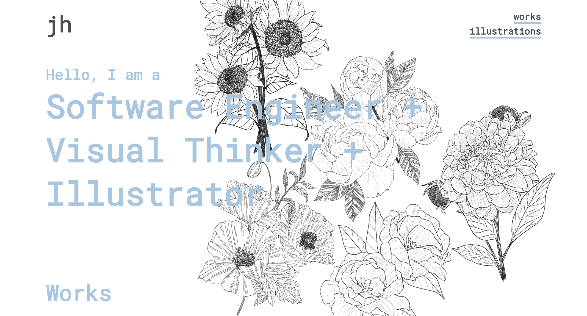
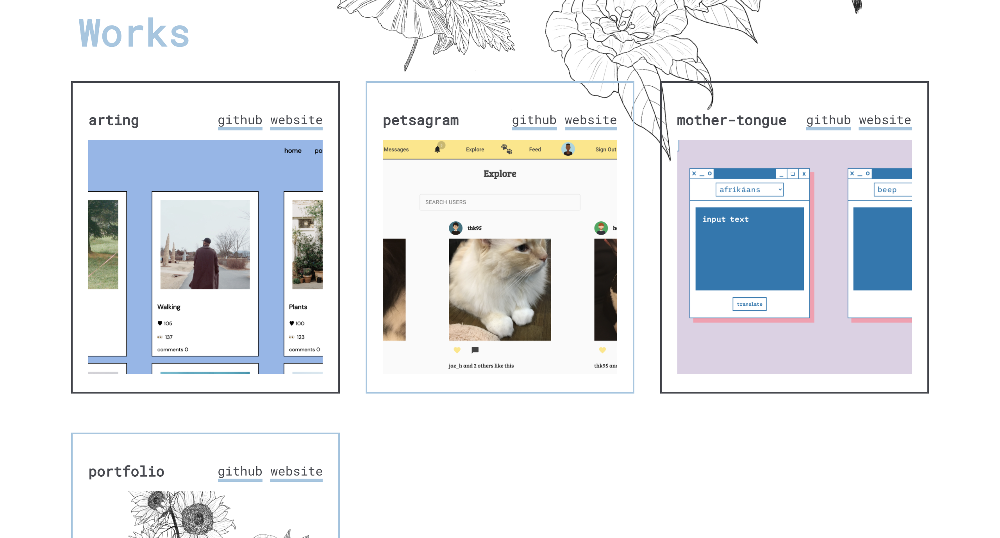
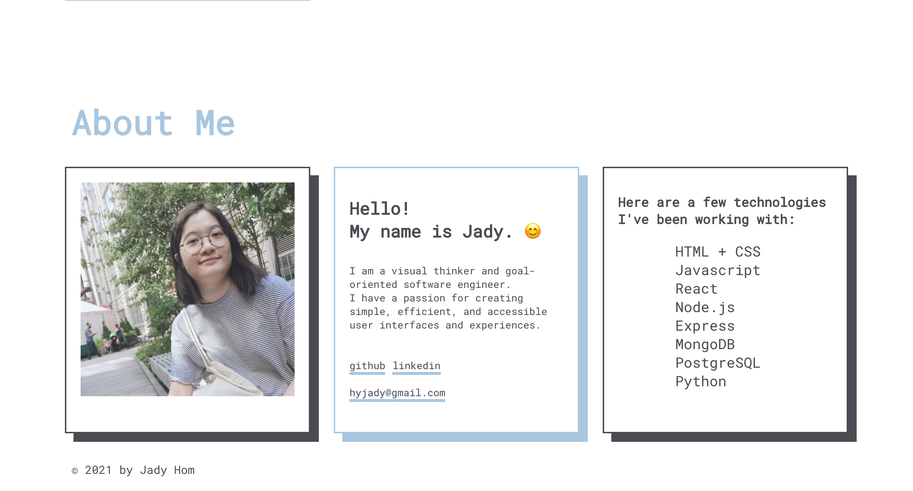
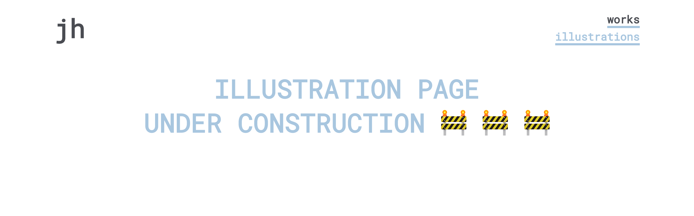

# Jady Hom Portfolio

#### Jady Hom

[Github](https://github.com/jadyhome) | [LinkedIn](www.linkedin.com/in/jadyhom)

---

### Description

A portfolio website to showcase all my projects and works, with links to my GitHub, LinkedIn, About Me, and my Contact Info.

---

### Technologies Used

- HTML + CSS
- Javascript
- React

---

### Getting Started

Check out my portfolio website → [Here](https://jadyhom.netlify.app/)

---

### Wireframe / Screenshots

Final Mockup/Wireframe

Home / Header

Work

About

---

### Future Updates

- [ ] More Projects!
- [ ] Work In Progress: a Works Page with all my projects
- [ ] Work In Progress: a Illustrations Page with all my illustration works

---

### Credits

[Netlify](www.netlify.com)

[Google Font - Roboto Mono](https://fonts.google.com/specimen/Roboto+Mono?preview.text_type=custom)