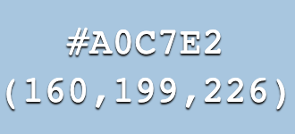
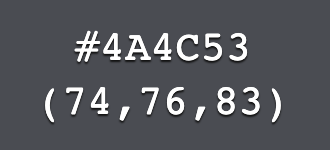
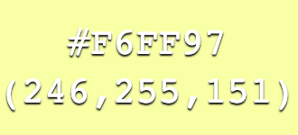
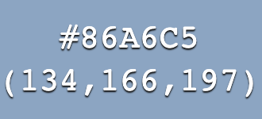
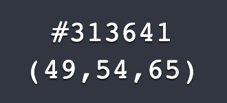
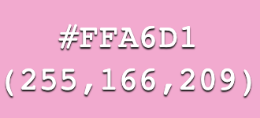
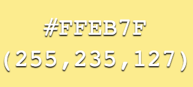
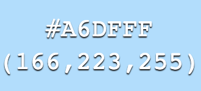
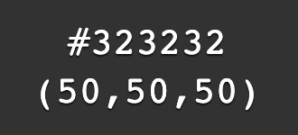
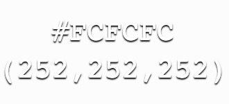

# Jady Hom Portfolio

#### by Jady Hom

[Github](https://github.com/jadyhome) | [LinkedIn](www.linkedin.com/in/jadyhom)

---

### Description

A portfolio website to showcase all my projects and works, with links to my GitHub, LinkedIn, About Me, and my Contact Info.

---

### Technologies Used

- HTML + CSS
- Javascript
- React

---

### Getting Started

Check out my portfolio website → [Here](https://jadyhom.netlify.app/)

---

### Future Updates

- [ ] More Projects!
- [x] Work In Progress: Illustrations

---

### Color Schemes

1st palette \

2nd palette \

3rd palette \

4th palette _(current color scheme)_ \

---

### Credits

[Netlify](www.netlify.com)

[Google Font - Roboto Mono](https://fonts.google.com/specimen/Roboto+Mono?preview.text_type=custom)

[Google Font - Karla](https://fonts.google.com/specimen/Karla?query=karla)
